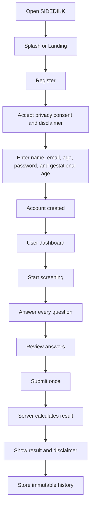
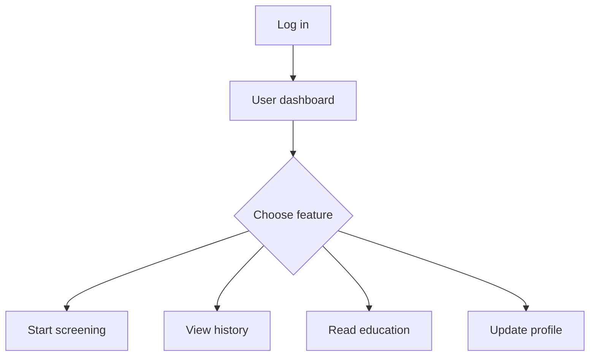
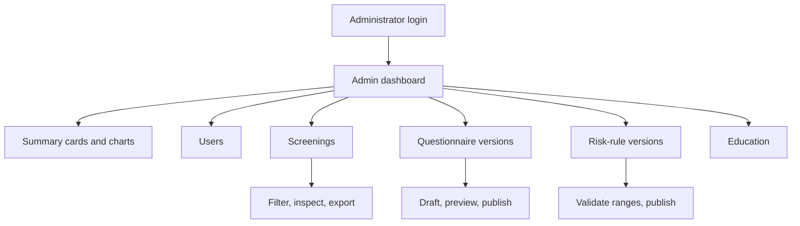
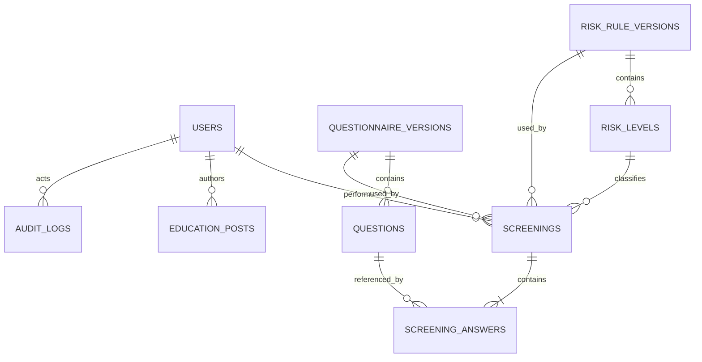
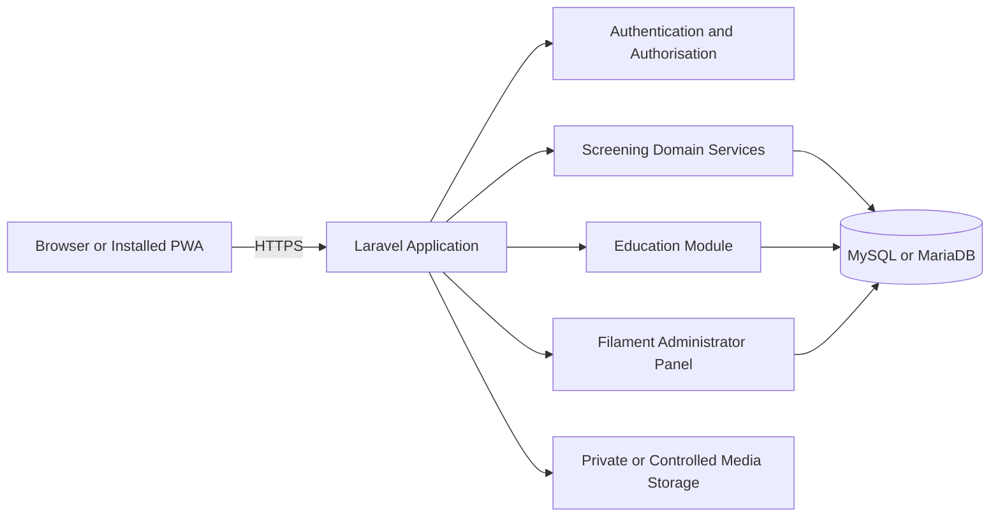

# Product Requirements Document (PRD)
# SIDEDIKK — Early Detection of Pregnancy Complications

**Document status:** Approved implementation baseline for MVP  
**Commercial package:** Professional  
**Document version:** 2.0 (English)  
**Application type:** Progressive Web App (PWA)  
**User-interface language:** Bahasa Indonesia  
**Documentation and source-code language:** English  
**Target domain:** `sidedikk.my.id` or another approved `.my.id` domain  
**Target hosting:** Medium shared hosting, 1.5 CPU cores, 2 GB RAM, SSL, one-year term  
**Product owner:** Client  
**Delivery team:** Development agency  
**Design reference:** Client-provided SIDEDIKK mock-up, refined into a consistent design system  

---

## 1. Product Summary

SIDEDIKK is a mobile-first web application for early pregnancy-complication screening. A pregnant user can register, maintain a basic profile and gestational age, answer a controlled screening questionnaire, receive a score and risk category, and review previous screening records.

An administrator can monitor users and completed screenings, view summary charts, filter and export reports, maintain educational content, and publish new questionnaire versions without changing historical results.

The application is delivered as a Progressive Web App. It can be opened through a browser and installed on a supported device without distribution through Google Play or the Apple App Store.

SIDEDIKK is an early-screening tool only. It must never present itself as a medical diagnosis or a replacement for examination by qualified health professionals.

---

## 2. Product Identity

### 2.1 Official Name

- **Brand name:** SIDEDIKK
- **Official spelling:** `SIDEDIKK`
- **Tagline:** `Deteksi Dini Komplikasi Kehamilan`
- **PWA short name:** `SIDEDIKK`
- **Manifest name:** `SIDEDIKK — Deteksi Dini Komplikasi Kehamilan`

The spelling must be finalised before production. The interface must not alternate between `SIDEDIK`, `Si Dedik`, and `SIDEDIKK`.

### 2.2 Product Values

- Simple to use on a mobile phone.
- Calm, supportive, and non-judgemental.
- Clear about the difference between screening and diagnosis.
- Reliable in preserving historical screening results.
- Practical for administrators to monitor and export data.
- Lightweight enough for the selected shared-hosting package.

### 2.3 Mandatory Medical Disclaimer

The final wording must be approved by the client or the responsible health professional. Until approved, use the following clearly marked draft:

> “SIDEDIKK merupakan alat skrining awal dan bukan diagnosis medis. Hasil aplikasi tidak menggantikan pemeriksaan tenaga kesehatan. Segera hubungi fasilitas kesehatan apabila mengalami keluhan berat atau kondisi darurat.”

The disclaimer must appear on:

- Registration or consent flow.
- Screening-result page.
- Screening-history detail page.
- Relevant footer or information page.

---

## 3. Product Goals

1. Provide a simple, mobile-friendly pregnancy screening flow.
2. Calculate a score and risk category only from client-approved rules.
3. Preserve historical results even after questions, scores, thresholds, or recommendations change.
4. Allow administrators to monitor screening activity and risk distribution.
5. Allow questionnaire and educational content updates without source-code changes.
6. Provide installable PWA behaviour without publishing a native application.
7. Operate reliably for the initial target of hundreds of daily users.
8. Minimise operational complexity on shared hosting.

---

## 4. Success Measures

The MVP is successful when:

- A new user can register, log in, complete a screening, and view the saved result.
- A returning user can see only their own screening history.
- An administrator can view, filter, and export screening records.
- Publishing a new questionnaire or risk-rule version does not alter completed screenings.
- The primary mobile flow works from a 320 px viewport upward.
- The PWA can be installed from supported browsers through HTTPS.
- The main automated tests pass before deployment.
- The application remains responsive during the agreed load-test scenario.

Business metrics that may be shown in the admin dashboard:

- Total registered users.
- Daily and monthly completed screenings.
- Completion rate of started screenings.
- Distribution of low, medium, and high risk.
- Number of repeat screenings.

---

## 5. Scope

### 5.1 Included in the Professional MVP

- User registration, login, logout, and profile.
- User age and gestational age.
- User dashboard.
- Yes/No screening questionnaire.
- Server-side score calculation.
- Client-approved risk classification.
- Screening result and recommendation.
- User screening history and answer details.
- Pregnancy-education content.
- Administrator panel.
- User and screening monitoring.
- Dashboard charts and filters.
- CSV export compatible with Excel and Google Sheets.
- Questionnaire draft, preview, versioning, and publishing.
- Versioned risk ranges and recommendations.
- Education-content management.
- Administrative audit trail.
- PWA manifest, icons, service worker, and offline fallback.
- `.my.id` domain and SSL configuration for one year.
- Medium shared hosting for one year.
- Handover backup and documentation.
- Two-week revision period for agreed-scope changes.
- One-month maintenance period for defect correction.

### 5.2 Excluded from the MVP

- Google Play or Apple App Store publication.
- Native Android or iOS application.
- Doctor consultation, live chat, or telemedicine.
- Payments.
- WhatsApp, SMS, or push notifications.
- Hospital, clinic, BPJS, or electronic-medical-record integration.
- Real-time location.
- Offline screening submission and later synchronisation.
- Multi-clinic or multi-tenant organisation support.
- Languages other than Bahasa Indonesia.
- Automated medical diagnosis.
- Medical-rule authoring by the developer.
- Bespoke premium UI/UX design by a dedicated designer.
- Large-scale research analytics or statistical analysis.

### 5.3 Commercial Boundaries

- Revisions cover corrections and reasonable adjustments within this PRD.
- New workflows, integrations, or modules require a separate estimate.
- Maintenance covers defects in delivered features, not new features or content production.
- Hosting and domain renewal after the first year are the client’s responsibility.

---

## 6. Users and Roles

### 6.1 Guest

A visitor who is not authenticated.

**Allowed:**

- View splash or landing page.
- Register.
- Log in.
- View privacy information.
- View and accept consent and medical disclaimer.

**Not allowed:**

- Start a screening.
- View protected education content.
- View any user or screening data.
- Access the administrator panel.

### 6.2 User / Pregnant User

An authenticated end user.

**Allowed:**

- View their dashboard.
- View and update their own profile.
- Update gestational age.
- Start and complete a screening.
- View their own result and answer details.
- View their own screening history.
- View published educational content.
- Install the PWA on a supported device.
- Log out.

**Not allowed:**

- Change calculated scores or risk categories.
- View another user’s profile or screening.
- Access administrator routes.
- Edit a completed screening.

### 6.3 Administrator

A trusted staff account created through a secure command, seeder, or controlled administrative process.

**Allowed:**

- Access the administrator dashboard.
- View user records required for monitoring.
- View completed screening records and answer snapshots.
- View charts and filtered reports.
- Export authorised data to CSV.
- Create and edit questionnaire drafts.
- Preview and publish a new questionnaire version.
- Create and edit risk-rule drafts.
- Publish a new risk-rule version.
- Create, edit, publish, unpublish, and archive education posts.
- View administrative audit logs.

**Not allowed:**

- View user passwords.
- Alter answers, scores, or classifications of completed screenings.
- silently rewrite historical records.
- Create medical rules without approved client input.
- Use the system to issue a diagnosis.

### 6.4 Permission Matrix

| Module | Guest | User | Administrator |
|---|:---:|:---:|:---:|
| Landing and legal pages | View | View | View |
| Registration and user login | Use | — | — |
| User dashboard | — | Own | — |
| User profile | — | Own, limited update | Read when authorised |
| Screening | — | Create and view own | Read completed records |
| Screening history | — | Own | All authorised records |
| Education | — | View published | Manage |
| Questionnaire | — | View active version during screening | Draft, preview, publish |
| Risk rules | — | View result only | Draft, validate, publish |
| Admin dashboard | — | — | Full access |
| Charts and filters | — | — | Full access |
| CSV export | — | — | Full access |
| Audit log | — | — | Read |

---

## 7. Main User Journeys

### 7.1 New User



### 7.2 Returning User



### 7.3 Administrator



---

## 8. Functional Requirements

### 8.1 Authentication

#### Registration fields

- Full name.
- Email address.
- User age.
- Password.
- Password confirmation.
- Gestational age in weeks and days.
- Privacy-consent checkbox.
- Screening-is-not-diagnosis checkbox.

#### Registration validation

- Name: 2–100 characters.
- Email: valid and unique.
- User age: integer within a client-approved range; temporary technical range 15–60.
- Password: minimum 8 characters and handled through Laravel password rules.
- Gestational weeks: temporary technical range 0–42.
- Gestational days: 0–6.
- Required consent must be checked.

The developer must not present temporary technical validation as medical guidance. Final ranges require client approval.

#### Login

- Email and password.
- Generic authentication error that does not reveal whether an email exists.
- Login rate limiting.
- Session regeneration after successful authentication.
- Role-aware redirect.

#### Logout

- End the current session.
- Regenerate or invalidate session state as appropriate.
- Return to login or landing page.

#### Password reset

- Optional for the first release.
- Enable only after the production mail configuration has been supplied and tested.

### 8.2 User Profile

Profile fields:

- Full name.
- Email.
- User age.
- Gestational weeks.
- Gestational days.
- Gestational-age reference timestamp.

Rules:

- The user enters gestational age during registration.
- The application stores the reference date and may calculate a display value from elapsed days.
- The user can correct gestational age in the profile.
- Each completed screening stores a gestational-age snapshot.
- Avatar upload is excluded from the MVP.

### 8.3 User Dashboard

The dashboard displays:

- Greeting using the user’s name.
- Current displayed gestational age.
- Trimester only when the rules have been approved by the client.
- Primary “Mulai Skrining” action.
- Education shortcut.
- Most recent screening record.
- Most recent risk badge.
- Bottom navigation: Beranda, Riwayat, Edukasi, Profil.
- PWA installation prompt when supported and not intrusive.

The dashboard must not:

- Show another user’s medical or personal information.
- describe a screening result as a diagnosis.
- calculate an estimated due date unless the formula and required input have been approved.

### 8.4 Screening Questionnaire

#### Question type

The MVP uses single-choice questions:

- `Ya`
- `Tidak`

Each question contains:

- Question text.
- Optional help text.
- Score for `Ya`.
- Score for `Tidak`.
- Display order.
- Active status.
- Questionnaire-version relationship.
- Creation and update timestamps.

#### Screening process

1. Load the published questionnaire version once when a screening starts.
2. Create an `in_progress` screening linked to that exact version.
3. Permit forward and backward navigation before submission.
4. Display progress such as `3/20`.
5. Require an answer for every active question.
6. Display a review page before submission.
7. Submit through an idempotent server endpoint.
8. Recalculate every score on the server using stored rules.
9. Save the screening, answers, score, classification, and snapshots in one database transaction.
10. Mark the screening `completed` only after the transaction succeeds.
11. Make completed records immutable.

#### Answer snapshots

Each saved answer must include:

- Original question ID when available.
- Questionnaire version ID.
- Question text at submission time.
- Selected answer.
- Awarded score.
- Display order at submission time.

### 8.5 Scoring and Risk Classification

Inputs:

- Validated answers.
- Scores from the published questionnaire version.
- Published risk-rule version.

Outputs:

- Total score.
- Maximum possible score for that questionnaire version.
- Risk category.
- Non-diagnostic explanation.
- Recommendation.
- Completion timestamp.
- Gestational-age snapshot.

Initial category labels:

- `Risiko Rendah`
- `Risiko Sedang`
- `Risiko Tinggi`

Rules:

- Questions, scores, thresholds, descriptions, and recommendations must come from the client or responsible health professional.
- The developer must not invent medical rules.
- Risk ranges in one published version must not overlap and must cover every possible score.
- A completed screening stores risk-category name, description, and recommendation snapshots.
- Later rule changes affect only newly started screenings.

### 8.6 Screening Result

Display:

- Total score, for example `8/20`.
- Risk category label.
- Non-diagnostic summary.
- Client-approved recommendation.
- Medical disclaimer.
- “Selesai” action.
- “Lihat Detail Jawaban” action.
- Return-to-dashboard action.

Risk presentation:

- Low: green semantic token.
- Medium: amber semantic token.
- High: red semantic token.
- Colour must never be the only indicator; always include text and an icon.

### 8.7 Screening History

List fields:

- Screening date.
- Gestational-age snapshot.
- Score.
- Risk category.
- Detail action.

Rules:

- A user can access only their own records.
- Sort newest first.
- Use server-side pagination, 10–20 records per page.
- Completed records are read-only.
- Detail pages show stored answer and result snapshots.

### 8.8 Education

User capabilities:

- View published article list.
- Search by title.
- Open article details.
- View publication date.
- View a cover image when available.

Administrator capabilities:

- Create, edit, preview, publish, unpublish, archive, or soft-delete an article.
- Manage title, slug, excerpt, body, cover image, status, and publication date.

Media rules:

- Accept approved JPG, PNG, or WebP images.
- Recommended upload limit: 1 MB per image.
- Validate extension, MIME type, and actual file content.
- Optimise images to WebP when practical.
- Do not host video files; use approved external links.

### 8.9 Administrator Dashboard

Summary cards:

- Total users.
- Total completed screenings.
- Screenings today.
- Low-risk count.
- Medium-risk count.
- High-risk count.

Charts:

- Risk-category distribution.
- Screening trend by day or month.
- Optional recent-user activity summary.

Filters:

- Date range.
- Risk category.
- User name or email.
- Optional gestational-age range.
- Screening status.

Table behaviour:

- Server-side pagination.
- Default 20 rows per page.
- Newest first.
- No unbounded “load all” query.
- Avoid N+1 queries.

### 8.10 CSV Export

- UTF-8 CSV compatible with Excel and Google Sheets.
- Apply the currently selected administrator filters.
- Minimum columns: date, name, email, user age, gestational age, score, maximum score, and risk category.
- Do not include full answer details by default.
- A detailed export requires explicit client approval and an additional confirmation step.
- Log every export action.
- Use streaming or chunking for large exports.

### 8.11 Questionnaire Management

The administrator can:

- Create a draft questionnaire version.
- Add, edit, reorder, activate, deactivate, and soft-delete draft questions.
- Set `Ya` and `Tidak` scores.
- Preview the complete draft.
- Publish the draft as a new immutable version.

Publishing rules:

- Exactly one questionnaire version is published for new screenings.
- Editing occurs only on a draft.
- Publishing creates or freezes a version; it must not edit an already published version in place.
- An in-progress screening continues using the version selected at start.
- Historical results are never recalculated.

### 8.12 Risk-Rule Management

The administrator can manage a draft risk-rule version containing categories with:

- Category name.
- Minimum score.
- Maximum score.
- Semantic colour key.
- Description.
- Recommendation.
- Display priority.
- Active status.

Validation before publishing:

- Ranges must not overlap.
- Ranges must cover all possible questionnaire scores.
- Every active range requires a label and recommendation.
- Publishing creates a new immutable version.
- Existing completed screenings remain unchanged.

### 8.13 Audit Log

Record at least:

- Administrator login.
- Questionnaire draft creation or change.
- Questionnaire publication.
- Risk-rule change and publication.
- Education-content change.
- Data export.
- Controlled user-data deletion when implemented.

Audit fields:

- Actor.
- Action.
- Subject type and ID.
- Timestamp.
- Safe metadata.
- Optional hashed or minimised IP indicator.

Never log passwords, tokens, or unnecessary health-answer content.

---

## 9. Page Inventory

### 9.1 Guest Pages

1. Splash or landing page.
2. User login.
3. User registration.
4. Privacy policy.
5. Medical disclaimer and consent information.

### 9.2 User Pages

1. Dashboard.
2. Screening question page.
3. Screening answer-review page.
4. Screening result.
5. Screening answer details.
6. Screening history.
7. Historical result detail.
8. Education list.
9. Education detail.
10. Profile.
11. Offline fallback.
12. 403, 404, 419, 422, 429, and 500 states.

### 9.3 Administrator Pages

1. Administrator login.
2. Dashboard.
3. User list and authorised detail.
4. Screening list and detail.
5. Questionnaire-version list.
6. Questionnaire draft editor.
7. Questionnaire preview and publish screen.
8. Risk-rule-version list and editor.
9. Education list and editor.
10. Audit log.
11. Administrator profile.

---

## 10. Data Model

### 10.1 Core Tables

#### `users`

- `id`
- `name`
- `email` unique
- `password`
- `role` (`user`, `admin`)
- `age`
- `pregnancy_weeks`
- `pregnancy_days`
- `pregnancy_updated_at`
- `privacy_consent_at`
- `medical_disclaimer_consent_at`
- timestamps
- optional soft delete only after client approval

#### `questionnaire_versions`

- `id`
- `version_number` unique
- `status` (`draft`, `published`, `archived`)
- `published_at`
- `published_by`
- timestamps

#### `questions`

- `id`
- `questionnaire_version_id`
- `question_text`
- `help_text` nullable
- `yes_score`
- `no_score`
- `sort_order`
- `is_active`
- timestamps
- soft delete

#### `risk_rule_versions`

- `id`
- `version_number` unique
- `status` (`draft`, `published`, `archived`)
- `published_at`
- `published_by`
- timestamps

#### `risk_levels`

- `id`
- `risk_rule_version_id`
- `name`
- `min_score`
- `max_score`
- `colour_key`
- `description`
- `recommendation`
- `sort_order`
- `is_active`
- timestamps

#### `screenings`

- `id`
- `public_id` or UUID unique for safe routing
- `submission_key` unique for idempotency
- `user_id`
- `questionnaire_version_id`
- `risk_rule_version_id`
- `risk_level_id` nullable reference
- `status` (`in_progress`, `completed`, `abandoned`)
- `total_score`
- `maximum_score`
- `risk_name_snapshot`
- `risk_description_snapshot`
- `risk_recommendation_snapshot`
- `pregnancy_weeks_snapshot`
- `pregnancy_days_snapshot`
- `started_at`
- `completed_at`
- timestamps

#### `screening_answers`

- `id`
- `screening_id`
- `question_id` nullable historical reference
- `question_text_snapshot`
- `selected_answer`
- `awarded_score`
- `sort_order_snapshot`
- timestamps

#### `education_posts`

- `id`
- `title`
- `slug` unique
- `excerpt`
- `content`
- `cover_image_path` nullable
- `status` (`draft`, `published`, `archived`)
- `published_at`
- `author_id`
- timestamps
- soft delete

#### `audit_logs`

- `id`
- `actor_id`
- `action`
- `subject_type`
- `subject_id`
- `metadata` JSON
- `ip_hash` nullable
- `created_at`

### 10.2 Required Indexes

- Unique index on `users.email`.
- Index on `users.role`.
- Composite index on `screenings(user_id, completed_at)`.
- Composite index on `screenings(status, completed_at)`.
- Composite index on `screenings(risk_level_id, completed_at)`.
- Unique index on `screenings.submission_key`.
- Index on `screening_answers.screening_id`.
- Composite index on `questions(questionnaire_version_id, sort_order)`.
- Composite index on `risk_levels(risk_rule_version_id, min_score, max_score)`.
- Composite index on `education_posts(status, published_at)`.
- Composite index on `audit_logs(actor_id, created_at)`.

### 10.3 Relationship Overview



---

## 11. Core Business Rules

1. Only one questionnaire version is published for new screenings.
2. Only one risk-rule version is published for new screenings.
3. A screening locks both versions at start.
4. Every active question must be answered before submission.
5. Scores are always calculated on the server.
6. One submission key can create at most one completed screening.
7. A completed screening is immutable.
8. Published versions are immutable; changes require a new draft and publication.
9. Historical result snapshots never change after later edits.
10. Users can access only their own protected data.
11. Administrators cannot view passwords or edit completed results.
12. Risk ranges must be non-overlapping and complete.
13. Every health-related result displays a disclaimer.
14. Data export is restricted to administrators and logged.
15. Sensitive data deletion must be controlled and auditable.

---

## 12. Progressive Web App Requirements

### 12.1 Installability

Provide:

- `manifest.webmanifest`.
- 192×192 and 512×512 icons.
- `name`, `short_name`, `start_url`, `scope`, `display: standalone`, theme colour, and background colour.
- HTTPS in production.
- A registered service worker.
- Mobile and iOS metadata.
- A non-intrusive install prompt where supported.
- An offline fallback page.

### 12.2 Cache Policy

Safe to cache:

- Fingerprinted CSS and JavaScript assets.
- Logo, icons, and static brand assets.
- Offline fallback page.
- Explicitly public, non-sensitive static content where appropriate.

Never cache through the service worker:

- Login responses.
- Authenticated HTML containing personal data.
- User profile.
- Screening forms or submissions.
- Results or screening history.
- Administrator pages.
- Exports.
- Any non-GET request.
- Any response containing sensitive health information.

Strategies:

- Cache-first for fingerprinted static assets.
- Network-first for public pages.
- Network-only for authenticated, administrator, screening, history, profile, export, and mutation routes.
- Version cache names and remove stale caches during activation.
- Screening requires an internet connection in the MVP.

### 12.3 PWA Acceptance

- Manifest is valid and linked from relevant pages.
- HTTPS is active.
- Required icons load correctly.
- `start_url` works.
- Standalone display works on supported devices.
- Offline fallback appears when appropriate.
- No sensitive authenticated response is present in Cache Storage.

---

## 13. Technology Stack

### 13.1 Required Baseline

| Layer | Technology |
|---|---|
| Application architecture | Laravel monolith |
| Backend framework | Laravel 13 |
| PHP runtime | PHP 8.3 or newer supported by the selected Laravel release |
| Database | MySQL 8 or compatible MariaDB |
| User frontend | Blade, Tailwind CSS 4, Alpine.js |
| Optional reactive UI | Livewire 4 only where it reduces complexity |
| Authentication | Laravel built-in authentication through the official starter-kit/Fortify path; no external identity provider |
| Administrator panel | Filament 5 |
| Build tool | Vite |
| Charts | Chart.js or Filament-compatible chart widgets |
| Export | Native streamed CSV for MVP |
| Authorisation | Middleware, policies, gates, and scoped queries |
| PWA | Standards-based manifest and service worker implemented in-project |
| Testing | Pest or PHPUnit, used consistently |
| Formatting | Laravel Pint |
| Source control | Git |
| Production platform | Medium shared hosting, 1.5 CPU cores and 2 GB RAM |
| Domain | `.my.id` |
| Transport security | HTTPS through hosting SSL or Let’s Encrypt |

### 13.2 Version Policy

Before implementation, the agent must inspect the repository and hosting environment.

- Do not overwrite an existing supported stack merely to match this table.
- For a fresh repository, target Laravel 13 and PHP 8.3+.
- Filament 5 is compatible with Laravel 11.28+ and PHP 8.2+, but all installed packages must be resolved by Composer before work proceeds.
- If the hosting environment cannot run the selected version, stop and document the conflict instead of silently downgrading.
- A fallback version requires an explicit, documented decision.

### 13.3 Hosting Preflight

Confirm:

- PHP version.
- Required PHP extensions.
- Composer 2 availability or a safe local-build deployment process.
- MySQL or MariaDB version.
- Ability to point the web root to Laravel’s `public` directory.
- Writable `storage` and `bootstrap/cache` directories.
- Cron availability if scheduled backup or maintenance tasks are used.
- SSL support.
- Maximum upload size, execution time, process limits, and database quotas.

### 13.4 Architecture Principles

- Use one Laravel monolith.
- Do not add React, Vue, a separate API, microservices, Redis, or a permanent queue worker unless a verified requirement makes it necessary.
- Use server-side pagination.
- Use database indexes and deliberate eager loading.
- Use short-lived cache for aggregate dashboard statistics.
- Keep all medical calculation logic in tested domain services.
- Keep secrets outside the repository.
- Prefer simple, maintainable Laravel conventions over speculative abstractions.



---

## 14. Capacity and Visitor Estimate

### 14.1 Planning Target

For the selected Medium shared-hosting plan with approximately 1.5 CPU cores and 2 GB RAM:

- Initial registered accounts: approximately 1,000–2,000.
- Normal planning target: approximately 200–500 active users per day.
- Dynamic concurrency target: approximately 10–20 users actively loading authenticated pages or submitting data at the same time.
- Minimum load test: 20 virtual users covering login, dashboard, questionnaire retrieval, submission, and history.

These figures are planning estimates, not a provider guarantee. Actual capacity depends on process limits, storage I/O, database limits, PHP configuration, query quality, page weight, cache behaviour, and simultaneous traffic patterns.

### 14.2 Capacity Assumptions

- Approximately 20–30 questions per questionnaire.
- Questions are loaded once per screening.
- Answers are persisted in one controlled submission transaction.
- Administrator tables use pagination.
- Charts use aggregate queries and short-lived cache.
- No hosted video.
- Images are compressed.
- No campaign causes hundreds of simultaneous submissions.
- No abusive bot traffic or scraping.

### 14.3 Upgrade Signals

Evaluate a larger plan, cloud hosting, or managed VPS when one or more conditions occur consistently:

- More than roughly 500–1,000 active users per day.
- More than roughly 20–30 dynamic concurrent users.
- p95 user response time above 3 seconds under normal traffic.
- Repeated resource-limit or HTTP 508 errors.
- CPU, memory, entry-process, or I/O limits are frequently reached.
- Large exports noticeably affect normal users.
- Database growth or backup duration becomes operationally difficult.
- A scheduled event or campaign creates concentrated traffic.

---

## 15. Performance Requirements

Target under normal load:

- Public page p95 below 2.5 seconds.
- Authenticated user page p95 below 3 seconds.
- Screening submission p95 below 3 seconds.
- Administrator dashboard p95 below 4 seconds.
- No unpaginated large list.
- No known N+1 query on primary flows.
- Compressed mobile assets and education images.
- Production optimisations enabled.
- `APP_DEBUG=false` in production.

Required optimisation:

- Appropriate eager loading.
- Database indexes.
- Dashboard-statistics cache for approximately 5–15 minutes.
- Rate limiting.
- Avoid `SELECT *` on large reporting queries.
- Do not rebuild every chart from all answer rows on every request.
- Stream or chunk large CSV exports.
- Run `php artisan optimize` and the appropriate Filament optimisation command during deployment.

---

## 16. Security and Privacy

Pregnancy information and screening results must be treated as sensitive personal data.

### 16.1 Mandatory Controls

- HTTPS.
- Laravel password hashing.
- CSRF protection.
- Server-side validation.
- Authorisation policies and scoped queries.
- Protection against insecure direct object reference.
- Secure production session cookies.
- Appropriate SameSite setting.
- Login and screening-submission rate limits.
- Output escaping and safe content rendering.
- File-upload validation.
- `.env` excluded from Git.
- `APP_DEBUG=false` in production.
- Backups outside the public web root.
- No passwords, session tokens, or excessive health data in logs.
- Consent timestamps.
- Privacy and disclaimer pages.
- Controlled administrator creation.
- Strong administrator credentials.
- No destructive production command without a verified backup.

### 16.2 Data Retention Decisions Required from Client

The client must decide:

- How long accounts and screening records are retained.
- Who can approve deletion.
- The process for a user deletion request.
- Whether exported data will be used for research.
- Whether exports must be anonymised or pseudonymised.
- Who may access identifiable screening data.

Default MVP behaviour:

- Retain data while the account remains active.
- Do not expose permanent self-deletion until policy is approved.
- Process deletion requests through a controlled administrator workflow outside the first MVP.
- Export the minimum fields needed for the agreed report.

---

## 17. Brand and Design System (GSM)

### 17.1 Visual Direction

The visual character must be:

- Warm.
- Reassuring.
- Friendly to pregnant users.
- Clean.
- Professional without appearing overly clinical.
- Calm rather than alarming.

Use the supplied mock-up as visual direction, not as a pixel-perfect specification.

### 17.2 Logo Rules

- Use the original logo supplied by the client.
- Do not redraw or trace the logo from a screenshot.
- Prepare full-logo, icon-only, monochrome, and light-background variants when assets are provided.
- Minimum clear space: approximately the height of the letter `S` in the wordmark.
- Do not stretch, rotate, recolour arbitrarily, or add heavy effects.
- Until official assets are supplied, use a replaceable `SIDEDIKK` wordmark placeholder.

Recommended asset structure:

```text
public/brand/
├── logo-full.svg
├── logo-mark.svg
├── logo-white.svg
├── icon-192.png
├── icon-512.png
└── favicon.ico
```

### 17.3 Colour Tokens

| Token | Hex | Intended use |
|---|---|---|
| `primary-600` | `#9C36B5` | Primary actions, progress, active navigation |
| `primary-700` | `#7E2B94` | Hover, pressed, strong text on pale surfaces |
| `primary-100` | `#F2DDF6` | Soft cards and badges |
| `secondary-500` | `#E85D9E` | Supporting accent |
| `secondary-100` | `#FCE8F2` | Soft accent background |
| `background` | `#FFFDFE` | Application background |
| `surface` | `#FFFFFF` | Cards and modals |
| `text-primary` | `#2D2530` | Primary text |
| `text-secondary` | `#6B6470` | Supporting text |
| `border` | `#E9DFEA` | Dividers and borders |
| `success` | `#238A57` | Low risk and success |
| `warning` | `#A96900` | Medium risk and warning |
| `danger` | `#C83E50` | High risk and errors |
| `info` | `#346FC2` | Neutral information |

Rules:

- Verify readable contrast for every text/background combination.
- Never use pale pink as body text.
- Risk state always uses a text label and icon in addition to colour.

### 17.4 Typography

- Primary font: Inter.
- Fallback: `ui-sans-serif, system-ui, -apple-system, BlinkMacSystemFont, "Segoe UI", sans-serif`.
- Prefer local or build-bundled font assets where licensing permits.
- Use clear, non-decorative headings.

| Token | Size | Weight |
|---|---:|---:|
| Display | 32 px | 700 |
| H1 | 28 px | 700 |
| H2 | 24 px | 700 |
| H3 | 20 px | 600 |
| Body Large | 18 px | 400/500 |
| Body | 16 px | 400 |
| Small | 14 px | 400/500 |
| Caption | 12 px | 400/500 |

Body line height must be at least 1.5.

### 17.5 Spacing and Sizing

Use a 4 px base scale:

- 4, 8, 12, 16, 20, 24, 32, 40, 48, 64 px.
- Mobile card padding: 16 px.
- Section spacing: 24–32 px.
- Button height: minimum 48 px.
- Touch target: minimum 44×44 px.

### 17.6 Radius and Shadow

- Input radius: 10 px.
- Button radius: 12 px.
- Card radius: 16 px.
- Modal radius: 20 px.
- Pill and badge radius: 999 px.
- Use subtle shadows only.

### 17.7 Required Components

- Primary, secondary, ghost, and danger buttons.
- Text and password inputs.
- Select input.
- Yes/No radio cards.
- Consent checkbox.
- Progress bar.
- Risk badge.
- Statistics card.
- Education card.
- Screening-history card.
- Empty state.
- Alert.
- Confirmation modal.
- Skeleton and loading state.
- Bottom navigation.
- Administrator table.
- Pagination.
- Filter bar.

Every interactive component requires:

- Default.
- Hover when relevant.
- Focus.
- Active or pressed.
- Disabled.
- Loading.
- Error.
- Success where relevant.

### 17.8 Icons and Illustration

- Use one consistent icon family, such as Heroicons.
- Standard icon sizes: 20 px and 24 px.
- Keep stroke style consistent.
- Pregnancy illustrations must be respectful, inclusive, and non-graphic.
- Every asset must be client-supplied, properly licensed, or replaceable.

### 17.9 Interface Voice

The user interface remains in Bahasa Indonesia.

Tone:

- Warm.
- Clear.
- Non-judgemental.
- Calm.
- Free from unexplained medical jargon.

Examples:

- Preferred: `Jawab sesuai kondisi yang sedang Ibu alami.`
- Avoid: `Jawaban salah.`
- Preferred: `Pertanyaan ini belum dijawab.`
- Urgent language may be used only when supplied or approved by the responsible health professional.

---

## 18. Responsive Design and Accessibility

Breakpoints:

- Mobile: 320–639 px.
- Tablet: 640–1023 px.
- Desktop: 1024 px and above.

Requirements:

- Mobile-first layout.
- No horizontal page scrolling.
- Forms usable with one hand where practical.
- Bottom navigation accounts for safe areas and browser UI.
- Administrator interface is desktop-first but remains usable on tablet and mobile.
- Explicit form labels.
- Validation errors associated with fields.
- Visible keyboard focus.
- Semantic HTML.
- `aria-live` for important status updates.
- Sufficient contrast.
- No colour-only meaning.
- Alternative text for meaningful images.
- Browser zoom support.
- Respect `prefers-reduced-motion`.

---

## 19. Error Handling

Handle at least:

- Lost internet connection.
- Expired session.
- Duplicate submission.
- Questionnaire version change during an in-progress screening.
- No published questionnaire.
- Missing or invalid risk-rule coverage.
- Failed image upload.
- Oversized export.
- Database failure.
- 403, 404, 419, 422, 429, and 500 responses.

User-facing errors must not expose stack traces, SQL, secrets, or internal paths.

Suggested Bahasa Indonesia messages:

- `Koneksi terputus. Periksa internet, lalu coba kembali.`
- `Sesi Anda berakhir. Silakan login kembali.`
- `Hasil sudah tersimpan. Anda dapat melihatnya di Riwayat.`
- `Skrining belum tersedia. Silakan hubungi admin.`

---

## 20. Logging and Monitoring

Log:

- Application errors.
- Administrator authentication events.
- Medical-configuration publication.
- Failed screening submissions.
- Data exports.

Do not log:

- Passwords.
- Session or reset tokens.
- Full health-answer payloads unless strictly required for a controlled investigation.
- Excessive personally identifiable information.

Minimum operational monitoring:

- Laravel health endpoint such as `/up`.
- Disk usage.
- Database size.
- Hosting resource usage.
- Error logs.
- Optional external uptime monitor.
- Weekly review during the one-month maintenance period.

---

## 21. Backup and Recovery

Handover package:

- Database backup in SQL format.
- Uploaded media backup.
- Source code.
- `.env.example` without secrets.
- Restore guide.
- Ownership and account checklist.

Minimum backup events during delivery and maintenance:

- Before a major deployment or migration.
- After approved master medical content is loaded.
- At the end of the maintenance period.

Backups must be stored outside the public web directory and protected from unauthorised access.

---

## 22. Testing Strategy

### 22.1 Unit Tests

- Displayed gestational-age calculation.
- Score calculation.
- Risk-range classification.
- Risk-range validation.
- Questionnaire versioning.
- Risk-rule versioning.

### 22.2 Feature Tests

- Registration validation and consent.
- Login and logout.
- Role access.
- Cross-user data isolation.
- Profile update.
- Complete-answer requirement.
- Server-side scoring.
- Transaction rollback.
- Idempotent submission.
- Immutable completed screening.
- Questionnaire publication.
- Risk-rule publication.
- User-owned history.
- Administrator read-only access to completed screenings.
- Administrator-only CSV export.
- Published education visibility.
- Upload validation.

### 22.3 PWA Tests

- Manifest availability and required fields.
- Icons available.
- Service-worker registration.
- Offline fallback.
- No sensitive route stored in Cache Storage.
- Cache version upgrade and stale-cache removal.
- Installability on a supported Android browser.

### 22.4 Manual Tests

- Android Chrome.
- iPhone Safari when a device is available.
- Desktop Chrome and Edge.
- 320 px viewport.
- Slow connection.
- Expired session.
- Validation and server-error states.

### 22.5 Load Test

Minimum scenario:

- 20 virtual users.
- Log in.
- Open dashboard.
- Start screening.
- Retrieve 20–30 questions.
- Submit the result.
- Open screening history.

Record:

- p50 and p95 response time.
- Error rate.
- CPU, RAM, process, and I/O indicators available from hosting.
- Slow queries.
- Resource-limit errors.

---

## 23. Acceptance Criteria

The MVP is accepted when:

1. A user can register and log in.
2. A user can update their profile and gestational age.
3. A user can complete a screening without losing answers during an active session.
4. The server calculates scores from the approved master data.
5. Duplicate submission does not create duplicate completed results.
6. The result appears in the correct user’s history.
7. Historical results do not change after a new version is published.
8. The administrator can view summary statistics and authorised screening details.
9. The administrator can filter and export CSV data.
10. The administrator can manage and publish questionnaire and risk-rule versions.
11. The administrator can manage education content.
12. A normal user cannot access administrator pages.
13. A user cannot access another user’s data by changing a URL or request parameter.
14. The PWA is installable on a supported browser.
15. HTTPS is active.
16. No critical error remains in the primary flow.
17. Production uses `APP_DEBUG=false`.
18. Handover backup and documentation are available.
19. Required disclaimers are displayed.
20. Final questions and medical rules are supplied or approved by the client.
21. Core automated tests, formatter checks, and frontend build pass.
22. The application completes the agreed mobile and load-test checks.

---

## 24. Required Client Inputs

The client must provide or approve:

- Original logo files.
- Final official spelling of the product name.
- Final screening questions.
- `Ya` and `Tidak` score for each question.
- Risk thresholds.
- Risk descriptions and recommendations.
- Final medical disclaimer.
- Privacy and consent text.
- Education articles.
- Licensed images.
- Administrator email.
- Final domain choice.
- Final interface approval.
- Name or role of the person responsible for medical validity.
- Data-retention and deletion policy.


---

## 25. Deliverables

- Laravel source code and Git repository.
- Database migrations, factories, and safe seeders.
- User-facing PWA.
- Filament administrator panel.
- PWA manifest, icons, and service worker.
- Automated tests.
- `.env.example` without secrets.
- Local setup guide.
- Shared-hosting deployment guide.
- Administrator guide.
- Backup and restore guide.
- Security checklist.
- Initial backup.
- Domain and SSL configuration.
- Secure initial administrator-account procedure.
- Changelog.
- Dependency and licence list.

---

## 26. Implementation Phases

### Phase 0 — Audit and Decisions

- Audit repository and hosting.
- Verify PHP, extensions, database, Composer, Node, and web root.
- Confirm scope and unresolved client content.
- Produce implementation plan and risk register.

### Phase 1 — Foundation

- Initialise or align Laravel project.
- Configure database.
- Add authentication.
- Add roles, middleware, policies, and scoped queries.
- Establish design tokens and base layouts.
- Add factories, seeders, and initial tests.

### Phase 2 — User Experience

- Registration and consent.
- Login and logout.
- Profile and gestational age.
- Dashboard.
- Education list and detail.
- Loading, empty, error, and responsive states.

### Phase 3 — Screening Domain

- Questionnaire and risk-rule versioning.
- Screening session.
- Progress and answer review.
- Server-side scoring and classification.
- Idempotent transactional submission.
- Result and history snapshots.
- Ownership and immutability tests.

### Phase 4 — Administrator Panel

- Filament access control.
- Dashboard cards and charts.
- User and screening resources.
- Questionnaire draft and publish workflow.
- Risk-rule draft and publish workflow.
- Education management.
- CSV export.
- Audit log.

### Phase 5 — PWA

- Manifest.
- Icons.
- Service worker.
- Offline fallback.
- Install prompt.
- Secure cache-policy testing.

### Phase 6 — Hardening

- Security review.
- Query and asset optimisation.
- Accessibility review.
- Automated test completion.
- Load test.
- Final client-content import.

### Phase 7 — Deployment and Handover

- Domain and SSL.
- Production migration.
- Administrator account creation.
- Production optimisation.
- Smoke test.
- Backup.
- Documentation and handover.

---

## 27. Definition of Done

A feature is done only when:

- It matches this PRD.
- Client-side convenience validation and authoritative server-side validation exist where relevant.
- Authorisation is implemented and tested.
- Loading, empty, success, and error states are present.
- It is responsive at the required widths.
- It does not introduce a known N+1 query.
- Relevant automated tests pass.
- It does not commit secrets or sensitive data.
- It does not break existing features.
- Documentation is updated.
- It follows the design system.
- It does not invent medical content.

---

## 28. Locked Technical Decisions

- One Laravel monolith.
- Laravel 13 and PHP 8.3+ are the fresh-project target, subject to hosting preflight.
- Filament 5 for the administrator panel.
- Blade, Tailwind CSS 4, Alpine.js, and optional Livewire 4 for user-facing pages.
- MySQL or compatible MariaDB.
- Streamed CSV, not `.xlsx`, for the MVP export.
- Online screening only; no offline synchronisation.
- Service worker must not cache sensitive authenticated data.
- Questionnaire and risk rules are versioned.
- Completed results are immutable and snapshot-based.
- Medium hosting target: approximately 1.5 CPU cores and 2 GB RAM.
- Planning target: 200–500 daily active users and approximately 10–20 dynamic concurrent users.
- All medical content and rules originate from the client or responsible health professional.

---

## 29. Open Decisions Before Production

- Final product spelling and domain.
- Final logo assets.
- Final medical questions and scoring.
- Final risk ranges and recommendations.
- Final consent, privacy, and disclaimer wording.
- Password-reset email configuration.
- Retention and deletion policy.
- Whether administrator exports require anonymisation.
- Whether education content is public or authentication-protected.
- Exact hosting limits beyond CPU and RAM.


---

## 30. Instructions for an AI Development Agent

- Read this entire PRD before changing code.
- Audit the repository before selecting installation commands.
- Do not delete or overwrite unrelated work.
- Do not invent medical questions, scores, thresholds, recommendations, or diagnoses.
- Do not trust score values submitted by the browser.
- Do not cache authenticated health data in the service worker.
- Do not expose `.env`, backups, logs, or storage outside the intended public paths.
- Do not use unbounded table queries.
- Do not claim completion without passing tests and the frontend production build.
- Do not run destructive database commands outside a verified local or test environment.
- Stop and report before any irreversible operation, version downgrade, or production-data migration without backup.

